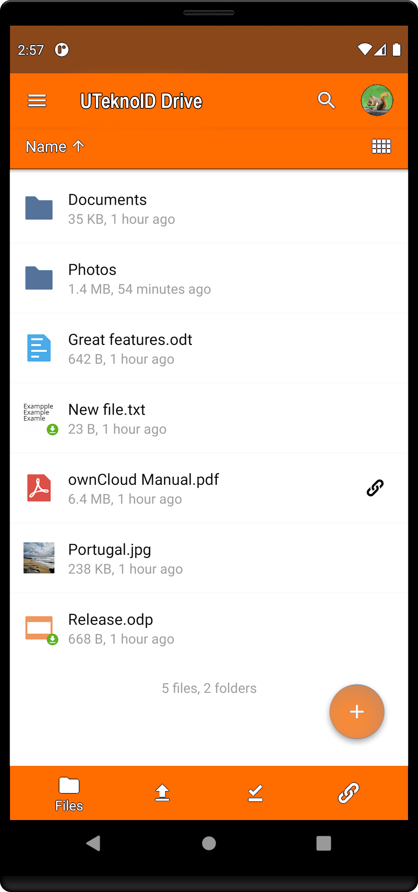
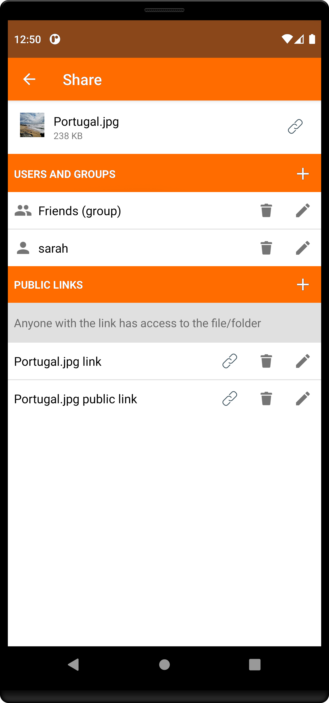

# [UTeknoID Drive](https://drive.uteknoid.com) Android app

|  |  |  |
| ---------------------------------------------- | -------------------------------------------- | ------------------------------------------- |

## Join development!

**Build status:**  

|master (Unit tests and data instrumented tests)| |
| :----- | :------ |
|**master (UI tests)**| |
|**stable**| |

**Start contributing:** Make sure you read [SETUP.md](https://github.com/uteknoid/uteknoid-drive/blob/master/SETUP.md) when you start working on this project. Basically: Fork this repository and contribute back using pull requests to the master branch.
Easy starting points are also reviewing [pull requests](https://github.com/uteknoid/uteknoid-drive/pulls) and working on [contributions are welcome](https://github.com/uteknoid/uteknoid-drive/issues?q=is%3Aopen+is%3Aissue+label%3A%22Contributions+are+welcome%22).

**Forum:** [#Android](https://central.uteknoid.org/c/android)

**License:** [GPLv2](https://github.com/uteknoid/uteknoid-drive/blob/master/LICENSE.txt)

## Join testing!

If you are interested in testing the new features before being released and give us your feedback, please try out our beta channels:

**Play Store**

1. Download uteknoid app from Play Store.
2. Go to uteknoid tab in Play Store and scroll down to the end of the view.
3. Press the **I'M IN** button to join the beta program and your final app will be replaced with the beta one.

Note: If you want to use the uteknoid production version you have to leave the beta program, uninstall the app, and reinstall the production version.

**F-Droid**

1. Go to uteknoid tab in F-Droid.
2. Open versions section.
3. Download the latest version that contains beta in the name.
